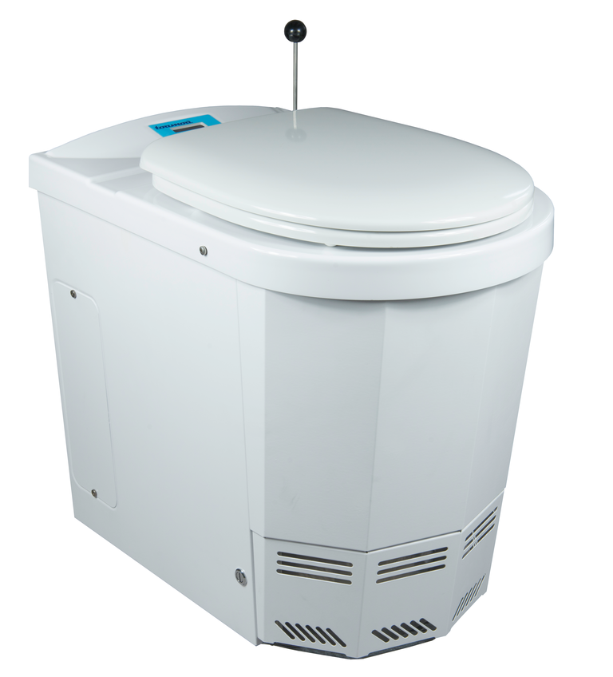

# kiln_controller

Need to replace the old controller on the incineration toilet - why not?-> esp32, max31855, thermocouple type K, relays.

 

 ## TODO

- [ ] Restore data from cloud;
- [ ] Safety checks;

## VOID

"Lorem ipsum dolor sit amet, consectetur adipiscing elit, sed do eiusmod tempor incididunt ut labore et dolore magna aliqua. Ut enim ad minim veniam, quis nostrud exercitation ullamco laboris nisi ut aliquip ex ea commodo consequat. Duis aute irure dolor in reprehenderit in voluptate velit esse cillum dolore eu fugiat nulla pariatur. Excepteur sint occaecat cupidatat non proident, sunt in culpa qui officia deserunt mollit anim id est laborum."

## Bil of materials

Description | Price
------------ | -------------
[4x Modules enclosure](https://www.amazon.de/gp/product/B07K5X5KZQ/ref=ppx_yo_dt_b_asin_title_o00_s00?ie=UTF8&psc=1) | €8.00
[Energy meter with S0 output](https://www.amazon.de/gp/product/B083H7NT2R/ref=ppx_yo_dt_b_asin_title_o00_s01?ie=UTF8&psc=1) | €13.00
[HDR-15 Power Supply](https://www.amazon.de/gp/product/B06XWQSJGW/ref=ppx_yo_dt_b_asin_title_o00_s00?ie=UTF8&psc=1) | €13.00
[AC contactor](https://www.amazon.de/gp/product/B07GXM2Q3S/ref=ppx_yo_dt_b_asin_title_o00_s00?ie=UTF8&psc=1) | €10.00
esp8266 | €5.00
max31855 | €10.00
[Type-K thermocouple](https://www.keramik-kraft.com/en/Kiln-Building--Repair/Pyrometry/Thermocouple-Nickel-Typ-K/Thermocouple-Type-K-open-with-flange-l-12cm.html?sel=13) | €50.00
Cables, terminals, etc | €10.00

Total: **€120.00**

## Known Limitations

* 

## Credits

Github Shields and Badges created with [Shields.io](https://github.com/badges/shields/)
